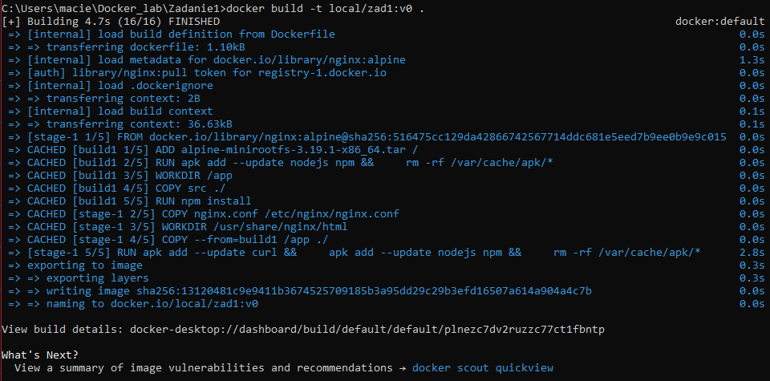
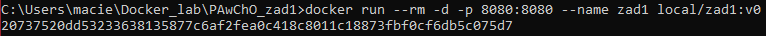
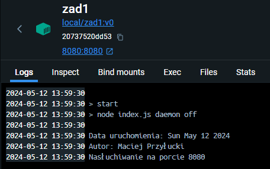
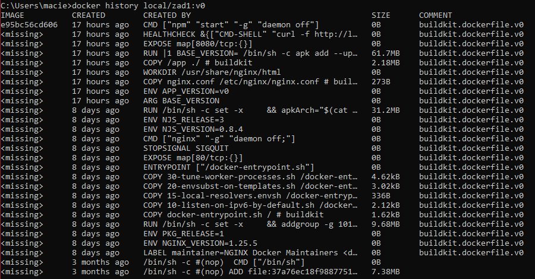
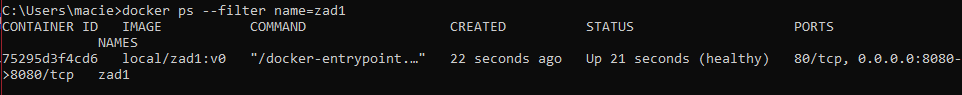
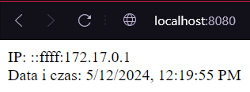

# Programowanie Aplikacji w Chmurze Obliczeniowej - Zadanie 1
### Maciej Przyłucki 
 
Plik Dockerfile został skonstruowany w oparciu o rozwiązanie z laboratorium 5, gdzie również należało utworzyć obraz pozwalający na uruchomienie serwera. Kod aplikacji znajduje się w folderze <i>src</i>.
  
Zbudowanie opracowanego obrazu kontenera:  
(Polecenie zostaje rozszerzone w części dodatkowej)  

  
Uruchomienie kontenera na podstawie zbudowanego obrazu:  

  
Uzyskanie informacji wygenerowanych przez serwer:  

  
Sprawdzenie warstw obrazu:  

  
Weryfikacja działania aplikacji:  

  
Zrzut ekranu z okna przeglądarki:  
(Data wyświetlana jest w formacie amerykańskim)  

