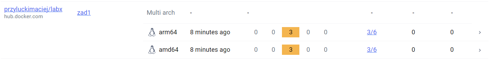

# Programowanie Aplikacji w Chmurze Obliczeniowej - Zadanie 1 (część dodatkowa)
### Maciej Przyłucki 
 
Utworzenie buildera:  

  
Zbudowanie obrazu:  
Obraz jest budowany na architektury <i>linux/amd64</i> oraz <i>linux/arm64</i> i korzysta z buildera opartego o sterownik <i>docker-container</i>. Przy budowie obrazu wykorzystywane są dane cache. W trakcie budowy podawane jest id sekretu zapisanego w pliku Dockerfile oraz ścieżka do pliku z danymi do ukrycia.  

  
Weryfikacja zbudowanego obrazu:  

  
Zrzut ekranu z platformy Docker Scout. Nie wykryto podatności na poziomie krytycznym lub wysokim.  

  
<a href="https://hub.docker.com/repository/docker/przyluckimaciej/labx/general">Link do repozytorium na Docker Hub</a>